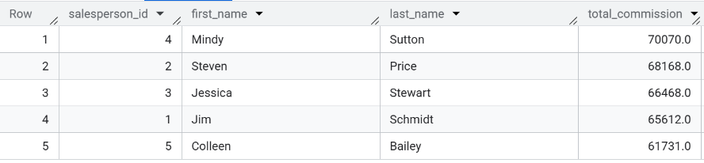
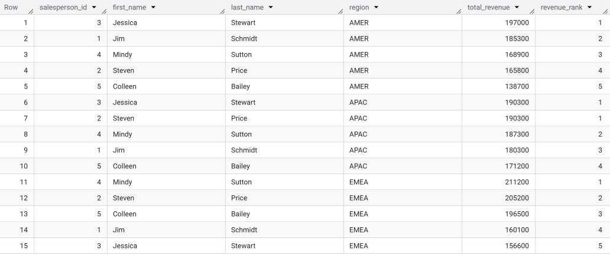
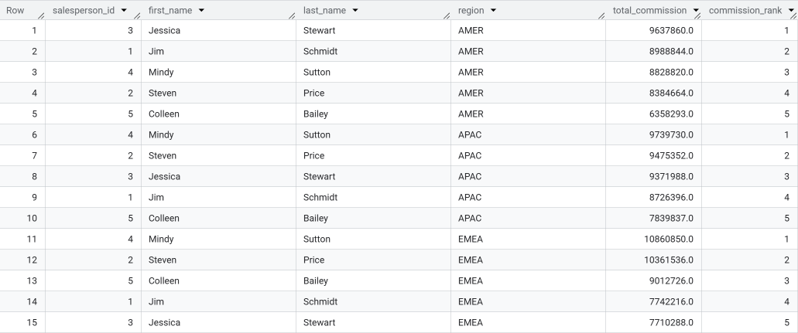
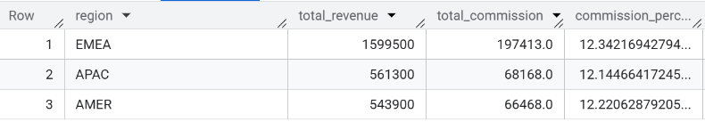
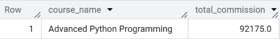

# SQL for Business Insights

## Overview

This project demonstrates SQL skills by analyzing a sales commission dataset. The dataset is generated using Python in a Jupyter notebook and uploaded to Google BigQuery for analysis. In this project, I focus on querying data related to sales performance and commission distribution across different salespeople. The key insights drawn from the analysis help in evaluating the performance of salespeople and making business recommendations.

## Project Structure

- **`mock_data.ipynb`**: Jupyter notebook that generates the mock sales data using Python and saves it as CSV files for uploading to BigQuery.
- **`data/`**: Folder containing the CSV files generated by the Jupyter notebook.
- **`images/`**: Folder containing screenshots of all SQL query outputs.
- **`README.md`**: Documentation of the project, including SQL queries, insights, and recommendations.

## Question 1: What is the total commission earned by each salesperson?

This query calculates the total commission earned by each salesperson:

```sql
SELECT 
    sp.salesperson_id,
    sp.first_name,
    sp.last_name,
    SUM(co.commission_amount) AS total_commission
FROM `regal-bonito-467416-p3.edtech.commissions` co
JOIN `regal-bonito-467416-p3.edtech.salespersons` sp ON co.salesperson_id = sp.salesperson_id
GROUP BY sp.salesperson_id, sp.first_name, sp.last_name
ORDER BY total_commission DESC;
```

## Query Output

Below is a screenshot showing the query output with the total commission earned by each salesperson:



## Insights

### Top Performers:
- **Mindy Sutton** earned the highest commission ($70,070), followed by **Steven Price** ($68,168) and **Jessica Stewart** ($66,468).
- The **lowest performer** in this query is **Colleen Bailey** with $61,731 in commissions.

### Commission Distribution:
- The total commissions for the top 5 salespeople have a relatively small range between them, suggesting a balanced performance across the team.

### Business Recommendations:
1. **Recognize Top Performers**: Reward Mindy Sutton and Steven Price for their exceptional performance.
2. **Support for Lower Performers**: Colleen Bailey could benefit from additional training or mentorship to help improve sales and commission.
3. **Incentive Programs**: Consider implementing an incentive program to encourage consistent performance across the team.

---

## Question 2: Which salesperson ranks highest in total revenue generated in each region?

This query ranks salespeople by their total revenue within each region:

```sql
SELECT 
    sp.salesperson_id,
    sp.first_name,
    sp.last_name,
    s.region,
    SUM(c.course_fee) AS total_revenue,
    DENSE_RANK() OVER (PARTITION BY s.region ORDER BY SUM(c.course_fee) DESC) AS revenue_rank
FROM `regal-bonito-467416-p3.edtech.enrollments_with_salesperson` e
JOIN `regal-bonito-467416-p3.edtech.salespersons` sp ON e.salesperson_id = sp.salesperson_id
JOIN `regal-bonito-467416-p3.edtech.courses` c ON e.course_id = c.course_id
JOIN `regal-bonito-467416-p3.edtech.students` s ON e.student_id = s.student_id
GROUP BY sp.salesperson_id, sp.first_name, sp.last_name, s.region
ORDER BY s.region, revenue_rank;
```

## Query Output

Below is a screenshot showing the query output with the total revenue generated by each salesperson in each region:



## Insights

### Highest Revenue Generators by Region:
- **AMER Region**: **Jessica Stewart** generated the highest revenue ($197,000), followed by **Jim Schmidt** ($185,300).
- **APAC Region**: **Jessica Stewart** and **Steven Price** both generated the highest revenue ($190,300), with a tie for the top rank.
- **EMEA Region**: **Mindy Sutton** generated the highest revenue ($211,200), followed by **Steven Price** ($205,200).

### Revenue Distribution:
- The **AMER region** shows a clear ranking from highest to lowest, with Jessica Stewart leading the pack.
- The **APAC region** shows a tie at the top, indicating strong performance from both Jessica Stewart and Steven Price.
- In the **EMEA region**, Mindy Sutton stands out as the highest revenue generator, but the competition remains close between the top performers.

### Business Recommendations:
1. **Reward Top Performers by Region**: Recognize **Jessica Stewart** (AMER and APAC) and **Mindy Sutton** (EMEA) for their outstanding revenue generation in their respective regions.
2. **Further Incentive for Tied Performers**: For the **APAC region**, where **Jessica Stewart** and **Steven Price** tied for the top spot, consider offering additional incentives to both to maintain this high performance.
3. **Targeted Regional Training**: Based on the distribution, consider offering region-specific training programs to maximize performance in areas with more balanced or lower revenue distributions.

---
## Question 3: How does commission compare across salespeople, and where does each rank in total commission in their region?

This query ranks salespeople by the total commission they earned within their respective regions:

```sql
SELECT 
    sp.salesperson_id,
    sp.first_name,
    sp.last_name,
    s.region,
    SUM(co.commission_amount) AS total_commission,
    RANK() OVER (PARTITION BY s.region ORDER BY SUM(co.commission_amount) DESC) AS commission_rank
FROM `regal-bonito-467416-p3.edtech.commissions` co
JOIN `regal-bonito-467416-p3.edtech.salespersons` sp ON co.salesperson_id = sp.salesperson_id
JOIN `regal-bonito-467416-p3.edtech.enrollments_with_salesperson` e ON sp.salesperson_id = e.salesperson_id
JOIN `regal-bonito-467416-p3.edtech.students` s ON e.student_id = s.student_id
GROUP BY sp.salesperson_id, sp.first_name, sp.last_name, s.region
ORDER BY s.region, commission_rank;
```
## Query Output

Below is a screenshot showing the query output with the total commission earned by each salesperson in each region:



## Insights

### Rank Comparison:
- **Mindy Sutton** consistently ranks among the top performers in all regions, with the highest total commission in **EMEA** and **APAC**, and the third-highest in **AMER**.
- **Jessica Stewart** performs well in **AMER** and **APAC**, ranking first and third respectively, but lags behind in **EMEA**.
- **Steven Price** shows strong performance across all regions, often ranking second or third.
- **Colleen Bailey** consistently ranks at the bottom in all three regions, which suggests a need for performance improvement or additional support.

## Business Recommendations

1. **Incentivize Top Performers**: Recognize **Mindy Sutton** and **Jessica Stewart** for their exceptional performance in the **EMEA** and **AMER** regions, and reward them with performance bonuses or leadership opportunities.

2. **Support for Colleen Bailey**: Provide targeted mentorship or additional training for **Colleen Bailey**, who ranks at the bottom in all regions, to boost her performance and help close the performance gap.

3. **Cross-Regional Knowledge Sharing**: Encourage **Steven Price** and the top performers in each region to share best practices and strategies, fostering collaboration and improving overall team performance across all regions.

---

## Question 4: What is the total revenue generated by region, and how does it compare to commission earned?

This query compares the total revenue with total commission earned by region using Common Table Expressions (CTEs):

```sql
WITH region_revenue AS (
    SELECT 
        s.region,
        SUM(c.course_fee) AS total_revenue
    FROM `regal-bonito-467416-p3.edtech.enrollments_with_salesperson` e
    JOIN `regal-bonito-467416-p3.edtech.salespersons` s ON e.salesperson_id = s.salesperson_id
    JOIN `regal-bonito-467416-p3.edtech.courses` c ON e.course_id = c.course_id
    GROUP BY s.region
),
region_commission AS (
    SELECT 
        s.region,
        SUM(co.commission_amount) AS total_commission
    FROM `regal-bonito-467416-p3.edtech.commissions` co
    JOIN `regal-bonito-467416-p3.edtech.salespersons` s ON co.salesperson_id = s.salesperson_id
    GROUP BY s.region
)
SELECT 
    rr.region,
    rr.total_revenue,
    rc.total_commission,
    (rc.total_commission * 100.0 / rr.total_revenue) AS commission_percentage
FROM region_revenue rr
JOIN region_commission rc ON rr.region = rc.region
ORDER BY rr.total_revenue DESC;
```
## Query Output

Below is a screenshot showing the query output with the total revenue and total commission earned by each region:



## Insights

### Revenue vs. Commission Comparison:
- **EMEA**: Highest revenue ($1.6M) and commission ($197K), with a commission percentage of **12.34%**.
- **APAC**: $561K in revenue, $68K in commission, commission percentage of **12.14%**.
- **AMER**: Lowest revenue ($543K) and commission ($66K), with a commission percentage of **12.22%**.

### Overall Commission Structure:
- Commission percentages across all regions are similar (12.14% - 12.34%), indicating a consistent structure.
- **EMEA** leads in revenue, while **APAC** and **AMER** also contribute significantly.

## Business Recommendations

1. **Boost Revenue in APAC & AMER**: Explore new sales strategies to increase revenue and commissions in these regions.
2. **Reevaluate Commission Structure**: Ensure the commission structure effectively incentivizes growth, especially in lower-revenue regions.
3. **Support EMEA**: Invest in maintaining EMEA’s high performance through recognition, training, and market expansion.

---
## Question 5: Which courses generate the most total commission earned by salespeople?

This query calculates the total commission earned by salespeople for each course:

## Question 5: Which courses generate the most total commission earned by salespeople?

This query calculates the total commission earned by salespeople for each course:

```sql
SELECT 
    c.course_name,
    SUM(co.commission_amount) AS total_commission
FROM `regal-bonito-467416-p3.edtech.commissions` co
JOIN `regal-bonito-467416-p3.edtech.courses` c ON co.course_id = c.course_id
GROUP BY c.course_name
ORDER BY total_commission DESC
LIMIT 1;
```
## Query Output

Below is a screenshot showing the query output with the course generating the most total commission:



## Insights

- The course with the highest total commission earned by salespeople is **Advanced Python Programming**, generating a total commission of **$92,175**.

## Business Recommendations

1. **Promote High-Commission Courses**: Increase marketing efforts for **Advanced Python Programming** to drive more sales and revenue.
2. **Incentivize Sales for High-Commission Courses**: Offer additional incentives or bonuses for salespeople promoting top-earning courses like **Advanced Python Programming**.
3. **Monitor Performance of High-Commission Courses**: Continuously track the performance of **Advanced Python Programming** to ensure it maintains its position as a top earner.


